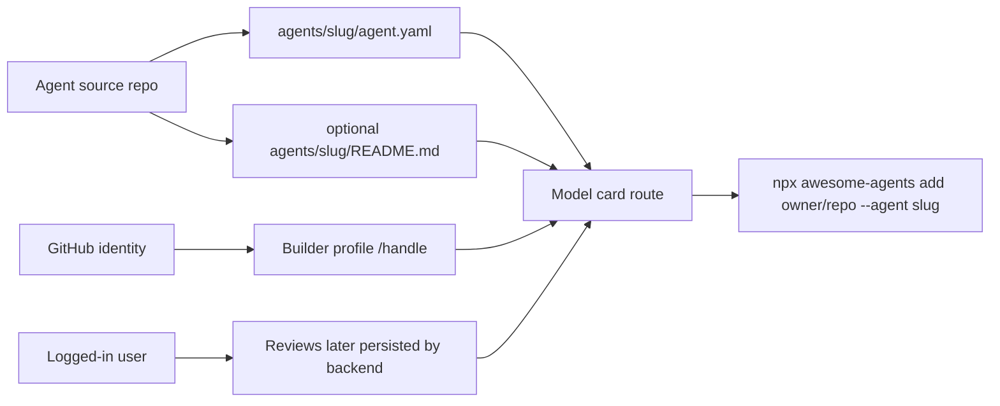

# Public Builder Profiles And Agent Model Cards

## Summary

Add the first public site slice for builder profiles and repository-scoped agent model cards, using GitHub identity assumptions and README-backed content where available while keeping the CLI source format repo-neutral.

## Boundaries

## Detailed Plan

## Summary

Implement the first public social-profile slice for `awesome-agents.com`: a builder profile route and repository-scoped agent model-card route. Keep it frontend-first and static-data-backed in this repo, while documenting the future backend contract for GitHub login, handle claiming, ownership verification, and reviews.

## Implementation Scope

1. Add site data structures for builders, repos, and agent cards.
2. Add `/pablof7z` style builder route support through `site/vercel.json` rewrites and a static page/controller.
3. Add `/pablof7z/touch-grass/chief-of-staff` style model-card route support.
4. Preserve the existing `/agents/:slug` page as compatibility or redirect-like behavior where practical.
5. Render optional README-backed model-card content when available in seeded data; render generated fallback sections when absent.
6. Add visible login/claim/review affordances as nonfunctional or mocked states only if clearly labeled by behavior, not by insecure fake auth.
7. Use the requested high-design frontend direction for the profile/model-card surfaces while keeping controls usable and text readable.

## Backend Boundary

Future GitHub auth should request basic profile and email access only, such as `read:user` plus `user:email`. The persisted user identity should include GitHub id, login, display name, avatar URL, and verified email where available. Handle claims are first-come-first-served. Repo ownership verification should be done through GitHub identity or GitHub App installation, not through user-entered claims alone. Reviews should require login; MVP has no spam filtering.

## Rollout

Ship the static route/content slice first. Keep existing directory links working. Once the UX holds up, add backend endpoints for auth callback, session, handle claims, repo imports, and review creation.

## Validation

Run `npm run lint` and `npm test` for the Node package. For site work, serve `site/` locally and inspect desktop and mobile routes with Playwright or a browser. Verify no horizontal overflow, route rewrites resolve, copy buttons still work, and old `/agents/:slug` pages are not broken.

## Rollback

Because the first slice is static, rollback is removing the new site page/controller/data entries and rewrites. CLI behavior should remain unaffected.

## Observability

No runtime observability is needed for the static slice. Future backend work should log OAuth callback failures, handle-claim conflicts, repo import failures, and review creation outcomes without logging tokens or private email values unnecessarily.

## Migration

No data migration is required for the first slice. Future migration should reserve existing GitHub usernames as default handles only when a user signs in or claims them, because handle policy is first-come-first-served.

## Risks

The main risk is making the prototype look like real auth or real persisted reviews. Keep those boundaries visually clear. The second risk is route collision between docs, assets, agent compatibility routes, and builder handles; rewrites should reserve known top-level paths before treating a path as a handle.

## Open Questions

Should launch support custom handles beyond GitHub usernames? Which metrics are platform-verified versus self-reported? What review moderation controls should be added once real volume exists?

## Rule And ADR Check

- Respects AGENTS.md by keeping runtime CLI behavior in `src/` untouched for the first site slice.
- Preserves source independence: no runtime CLI behavior, tests, or examples should hard-code one source repository.
- Matches product docs: README model-card content is optional, GitHub login requests basic profile plus email, reviews have no MVP spam filtering, and handles are first-come-first-served.
- Keeps examples that can write user directories behind dry-run or outside CLI examples.

## Possible Rule Or ADR Loosening

- No existing rule needs loosening for the frontend prototype.
- A future backend may need a new repository rule separating public site source fixtures from runtime CLI source fixtures so real showcased builders do not leak into CLI tests.

## Possible Rule Tightening

- Consider adding a rule that public site routes must prefer repo-neutral fixtures unless a page intentionally demonstrates a real claimed profile.
- Consider requiring auth-related docs to name requested OAuth scopes and stored identity fields before any backend implementation lands.

## Alternatives Considered

- Full backend now: enables real login and reviews, but expands scope into persistence, secrets, deployment, and security before route/content UX is validated.
- Only update product docs: too slow for the user's request to start building and does not test whether the social profile concept works on the site.
- Replace the existing directory with social profiles immediately: cleaner long-term shape, but risks breaking current static pages and install-directory behavior.

## Certainty

86 percent.

## Decision

ready

## Hosted Artifacts

- Plan page: Generated after publishing.

- TTS audio: https://blossom.primal.net/2faa2fde8c6b962e1b629f2fb2e212aa6fd5e2e61b07e89e43c63475e0d8c195.mp3
